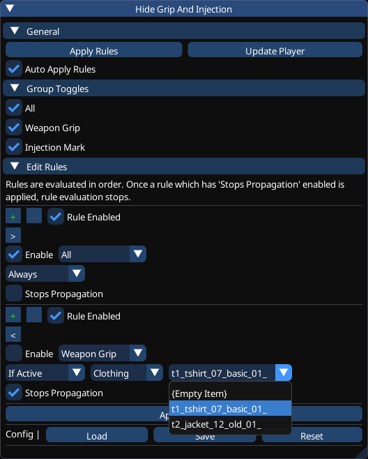

# CP77-HideGripAndInjection

## About

This mod allows to toggle the Weapon Grip and/or Injection Mark conditionally at runtime using hotkeys
and/or custom rules.

There's already a bunch of mods that do this through archive files by removing textures/meshes.
However, you're required to restart your game if you change your mind.
Moreover, this mod is also able to toggle the Weapon Grip within the inventory screen and photo mode.

You'll also be able to disable them based on current (arms-covering) clothing, weapons and/or cyberware
which may fix some clipping.

There's a specific patch for the quest "The Ripperdoc" which will apply after the quest completes.
Which means that while playing that quest the weapon grip and injection mark will display as usual.
Unless the auto-apply rules option is enabled which will hide the grip once you draw your weapon
(which is part of the quest) but it's seamless enough that it doesn't really matter.

### Requirements

- [CET 1.37.0+](https://github.com/yamashi/CyberEngineTweaks)

## Development

To improve your dev experience follow the README in [libs/cet](libs/cet).
